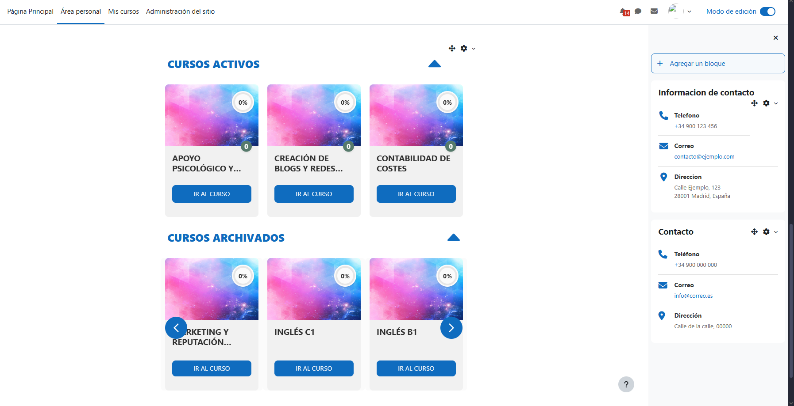
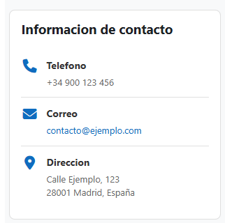

# 🔌 Colección de Plugins para Moodle

[](https://moodle.org/)
[](https://www.php.net/)
[](LICENSE)

## 📦 Resumen de Plugins

Este repositorio contiene cuatro plugins para Moodle listos para producción que demuestran diferentes enfoques arquitectónicos y mejores prácticas de desarrollo.

| Plugin | Tipo | Características Clave | Stack Tecnológico |
|--------|------|----------------------|-------------------|
| [**Dashboard Personal**](local/dashboard/) | Local | Analíticas de usuario, estadísticas en tiempo real | Mustache, SCSS, SQL |
| [**Cursos Slider**](blocks/cursos_slider/) | Block | Carrusel responsive con React, categorización automática | React 18.2, Vite, Hooks |
| [**Bloque Contacto**](blocks/contacto/) | Block | Renderizado basado en templates | Mustache, CSS |
| [**Bloque Info Contacto**](blocks/contact_info/) | Block | Implementación ligera | HTML Writer |

## 🚀 Características Principales

### Dashboard Personal

Un dashboard completo para usuarios con estadísticas en tiempo real y vista general de cursos.

**Características técnicas:**

- **Analíticas en Tiempo Real**: Seguimiento de inscripciones y completitud de actividades
- **Consultas Optimizadas**: Queries SQL eficientes con indexación apropiada
- **UI Moderna**: Compilación de SCSS con layouts responsive en grid
- **Sistema de Templates**: Templates Mustache para código mantenible
- **Soporte i18n**: Internacionalización completa (ES/EN)

[📖 Documentación Completa](local/dashboard/README.md) | [📸 Capturas](local/dashboard/screenshots/)

---

### Cursos Slider

Bloque interactivo con carrusel responsive construido con React que muestra los cursos del usuario.

**Características técnicas:**

- **Carrusel Responsive**: Hook personalizado `useResponsiveCarousel` para adaptación dinámica
- **Categorización Automática**: Cursos activos, terminados, próximos y archivados
- **Optimización de Rendimiento**: Lazy loading de GIFs, memoización de componentes
- **Componentes Modulares**: Arquitectura React escalable y mantenible
- **Multi-tema**: Compatible con Boost y temas personalizados
- **Soporte i18n**: Internacionalización completa (ES/EN)

[📖 Documentación Completa](blocks/cursos_slider/README.md) | [📖 Documentación React](blocks/cursos_slider/react/app/README.md) | [📸 Capturas](blocks/cursos_slider/screenshots/)

---

### Bloques de Contacto

Dos implementaciones que demuestran diferentes enfoques de renderizado:

**Basado en Mustache** (`contacto`):

- Arquitectura orientada a templates
- Fácil personalización y tematización
- Separación de responsabilidades

**HTML Writer** (`contact_info`):

- Implementación ligera
- Generación directa de HTML
- Mínimas dependencias

[📖 Documentación](blocks/contacto/README.md) | [📖 Documentación](blocks/contact_info/README.md)

## 💻 Stack Tecnológico

- **Backend**: PHP 7.4+ con API de Moodle 4.4
- **Frontend**: React 18.2, Templates Mustache, SCSS/CSS, Vite
- **Base de Datos**: MySQL/PostgreSQL con consultas optimizadas
- **Arquitectura**: Patrón MVC, componentes React, hooks personalizados
- **Seguridad**: Control de acceso basado en capabilities

## 🏗️ Aspectos Técnicos Destacados

### Optimización de Base de Datos

```php
// Consulta eficiente con joins apropiados
$sql = "SELECT COUNT(DISTINCT cm.id)
        FROM {course_modules} cm
        JOIN {course} c ON c.id = cm.course
        JOIN {enrol} e ON e.courseid = c.id
        JOIN {user_enrolments} ue ON ue.enrolid = e.id
        WHERE ue.userid = :userid 
        AND cm.completion > 0
        AND cm.deletioninprogress = 0";

$total = $DB->count_records_sql($sql, ['userid' => $userid]);
```

### Sistema de Templates

```php
// Separación clara de lógica y presentación
echo $OUTPUT->render_from_template('local_dashboard/index_page', [
    'username' => fullname($USER),
    'stats' => $stats,
    'courses' => $courses,
    'hascourses' => !empty($courses)
]);
```

### Hook Personalizado React

```javascript
// Hook para responsive design dinámico
export const useResponsiveCarousel = () => {
  const containerRef = useRef(null);
  const [containerWidth, setContainerWidth] = useState(0);

  useEffect(() => {
    const updateWidth = () => {
      if (containerRef.current) {
        setContainerWidth(containerRef.current.offsetWidth);
      }
    };
    updateWidth();
    window.addEventListener('resize', updateWidth);
    return () => window.removeEventListener('resize', updateWidth);
  }, []);

  const responsive = {
    desktop: {
      items: containerWidth > 1200 ? 6 : containerWidth > 900 ? 4 : 2
    }
  };

  return { containerRef, responsive };
};
```

### Compilación SCSS

```scss
// Estilos modulares y mantenibles
.dashboard-stats {
    display: grid;
    grid-template-columns: repeat(auto-fit, minmax(250px, 1fr));
    gap: 20px;
    
    .stat-card {
        background: #fff;
        border-radius: 8px;
        transition: transform 0.2s;
        
        &:hover {
            transform: translateY(-5px);
        }
    }
}
```

## 📊 Calidad de Código

- ✅ Sigue los estándares de codificación de Moodle
- ✅ Modelo de seguridad basado en capabilities
- ✅ Soporte completo de internacionalización
- ✅ Patrones de diseño responsive
- ✅ Documentación exhaustiva

## 🛠️ Instalación

Cada plugin puede instalarse de forma independiente. Consulta los archivos README individuales para instrucciones detalladas.

**Inicio Rápido:**

```bash
# Copiar a la instalación de Moodle
cp -r local/dashboard /ruta/a/moodle/local/
cp -r blocks/cursos_slider /ruta/a/moodle/blocks/
cp -r blocks/contacto /ruta/a/moodle/blocks/
cp -r blocks/contact_info /ruta/a/moodle/blocks/

# Navegar a notificaciones de administración
# Completar instalación vía interfaz de Moodle
```

**Compilación de SCSS (Dashboard):**

```bash
# Opción 1: Usando sass CLI
sass local/dashboard/scss/styles.scss local/dashboard/scss/styles.css

# Opción 2: Usando Grunt (requiere Node.js 20.x)
npx grunt scss --root=local/dashboard
```

## 📚 Documentación

Cada plugin incluye:

- README completo con ejemplos de código
- Documentación de arquitectura
- Guías de personalización
- Sección de solución de problemas
- Capturas de pantalla y demos

## 🔐 Seguridad

Todos los plugins implementan:

- **Control de acceso** basado en capabilities
- **Prevención de SQL injection** mediante consultas parametrizadas
- **Protección XSS** con escape apropiado de salida
- **Validación CSRF** mediante tokens de Moodle

### Ejemplo de Capabilities

```php
// Definición en db/access.php
$capabilities = [
    'local/dashboard:view' => [
        'captype' => 'read',
        'contextlevel' => CONTEXT_SYSTEM,
        'archetypes' => [
            'user' => CAP_ALLOW
        ]
    ]
];

// Verificación en código
require_capability('local/dashboard:view', context_system::instance());
```

## 🎨 Capturas de Pantalla

<div align="center">

### Dashboard Personal


### Cursos Slider



### Bloques de Contacto

<table>
  <tr>
    <td align="center" width="50%">
      
      <br/>
      <em>Bloque Contacto (Mustache)</em>
    </td>
    <td align="center" width="50%">
      
      <br/>
      <em>Bloque Info (HTML Writer)</em>
    </td>
  </tr>
</table>

</div>

## 📁 Estructura del Repositorio

```
moodle-plugins/
├── README.md                          # Este archivo
├── LICENSE                            # Licencia GPL v3
├── .gitignore                         # Archivos ignorados
├── local/
│   └── dashboard/                     # Plugin de dashboard
│       ├── README.md
│       ├── version.php
│       ├── index.php
│       ├── lib.php
│       ├── settings.php
│       ├── db/
│       ├── lang/
│       ├── templates/
│       ├── scss/
│       └── screenshots/
└── blocks/
    ├── cursos_slider/                 # Bloque con React
    │   ├── README.md
    │   ├── version.php
    │   ├── block_cursos_slider.php
    │   ├── services/
    │   ├── lang/
    │   ├── react/
    │   │   └── app/
    │   │       ├── README.md          # Documentación React
    │   │       ├── src/
    │   │       │   ├── components/
    │   │       │   └── hooks/
    │   │       └── dist/
    │   └── screenshots/
    ├── contacto/                      # Bloque con Mustache
    │   ├── README.md
    │   ├── version.php
    │   ├── block_contacto.php
    │   ├── settings.php
    │   ├── db/
    │   ├── lang/
    │   ├── templates/
    │   └── screenshots/
    └── contact_info/                  # Bloque básico
        ├── README.md
        ├── version.php
        ├── block_contact_info.php
        ├── settings.php
        ├── db/
        ├── lang/
        └── screenshots/
```

## 🔄 Workflow de Desarrollo

### Desarrollo Local

```bash
# 1. Clonar repositorio
git clone https://github.com/samuelp21/moodle-plugins.git

# 2. Copiar plugins a instalación de Moodle
cp -r moodle-plugins/local/* /ruta/a/moodle/local/
cp -r moodle-plugins/blocks/* /ruta/a/moodle/blocks/

# 3. Instalar desde interfaz de Moodle
# Administración → Notificaciones

# 4. Purgar cachés después de cambios
php admin/cli/purge_caches.php
```

### Compilación de Assets

```bash
# SCSS (Dashboard)
sass --watch local/dashboard/scss/styles.scss:local/dashboard/scss/styles.css

# Purgar cachés
php admin/cli/purge_caches.php
```

## 📈 Características por Plugin

| Característica | Dashboard | Cursos Slider | Contacto | Contact Info |
|----------------|-----------|---------------|----------|--------------|
| Templates Mustache | ✅ | ❌ | ✅ | ❌ |
| React/Vite | ❌ | ✅ | ❌ | ❌ |
| SCSS | ✅ | ❌ | ❌ | ❌ |
| Queries SQL Complejas | ✅ | ✅ | ❌ | ❌ |
| Hooks Personalizados | ❌ | ✅ | ❌ | ❌ |
| Multi-idioma | ✅ | ✅ | ✅ | ✅ |
| Configuración Global | ✅ | ❌ | ✅ | ✅ |
| Responsive Design | ✅ | ✅ | ✅ | ✅ |

## 📄 Licencia

GPL v3 o posterior (estándar de Moodle)

## 📞 Contacto

Para consultas profesionales o colaboraciones, puedes contactarme a través de:

- GitHub: [@samuelp21](https://github.com/samuelp21)
- LinkedIn: [Samuel Zabala](https://www.linkedin.com/in/samueljzd)

---

**Desarrollado con:** PHP • Moodle API • Mustache • SCSS • SQL

**Versión de Moodle:** 4.4+
