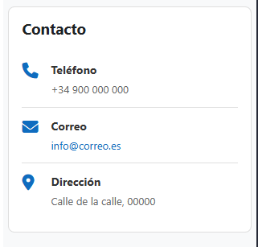
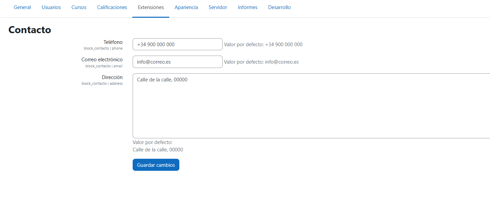

# 📞 Bloque de Contacto - Plugin para Moodle

Un bloque moderno para Moodle que muestra información de contacto de la plataforma utilizando templates Mustache y estilos personalizados.


## 🎯 Características

- 📞 **Teléfono de contacto** con icono
- 📧 **Email** con enlace mailto automático
- 📍 **Dirección física** con soporte multilínea
- ⚙️ **Configuración global** desde la administración del sitio
- 🎨 **Diseño moderno** con CSS personalizado
- 🔧 **Templates Mustache** para fácil personalización
- 🌍 **Soporte multi-idioma** (Inglés y Español)

## 📸 Capturas de Pantalla

<div align="center">

### Vista del Bloque



*Bloque mostrando información de contacto con iconos*

### Vista de Configuración



*Configuración global del bloque con teléfono, email y dirección*

</div>

## 🚀 Instalación

### Requisitos

- Moodle 4.4 o superior
- PHP 7.4 o superior

### Pasos de Instalación

1. **Copiar el plugin:**

   ```bash
   cp -r contacto /ruta/a/moodle/blocks/
   ```

2. **Instalar desde la interfaz:**
   - Acceder como administrador
   - Ir a: **Administración del sitio → Notificaciones**
   - Hacer clic en **Actualizar base de datos de Moodle**

3. **Configurar el bloque:**
   - Ir a: **Administración del sitio → Plugins → Bloques → Contacto**
   - Configurar teléfono, email y dirección
   - Guardar cambios

## ⚙️ Configuración

### Configuración Global

1. Navegar a: **Administración del sitio → Plugins → Bloques → Contacto**
2. Configurar los siguientes campos:

| Campo | Descripción | Ejemplo |
|-------|-------------|---------|
| **Teléfono** | Número de contacto | `+34 900 123 456` |
| **Correo** | Email de contacto | `contacto@ejemplo.com` |
| **Dirección** | Dirección física (multilínea) | `Calle Ejemplo 123`<br>`Madrid, España` |

3. Hacer clic en **Guardar cambios**

## 📱 Uso del Bloque

### Añadir el Bloque a una Página

1. Activar el **modo de edición** en cualquier página
2. Buscar **"Añadir un bloque"** en el menú lateral
3. Seleccionar **"Contacto"**
4. El bloque aparecerá mostrando la información configurada

### Personalizar Ubicación

- Arrastrar el bloque a diferentes regiones de la página
- Configurar visibilidad desde el menú del bloque (⚙️)

## 📁 Estructura del Plugin

```
blocks/contacto/
├── README.md                      # Esta documentación
├── version.php                    # Metadatos del plugin
├── block_contacto.php             # Clase principal del bloque
├── settings.php                   # Configuración global
├── styles.css                     # Estilos CSS personalizados
├── db/
│   └── access.php                 # Definición de capabilities
├── lang/
│   ├── en/
│   │   └── block_contacto.php     # Strings en inglés
│   └── es/
│       └── block_contacto.php     # Strings en español
└── templates/
    └── content.mustache           # Template del contenido
└── screenshots/                   # Capturas de pantalla
    └── bloque_contacto.png    # Captura de pantalla del bloque
    └── configuracion_contacto.png    # Captura de pantalla de la configuración del bloque
```

## 🛠️ Detalles Técnicos

### Arquitectura

Este bloque utiliza:

- **Templates Mustache**: Separación de lógica y presentación
- **Configuración Global**: Settings centralizados
- **CSS Personalizado**: Estilos propios del bloque
- **Multi-idioma**: Soporte completo de i18n

### Componentes Clave

#### 1. **Clase Principal (`block_contacto.php`)**

```php
public function get_content() {
    // Obtener configuración
    $phone = get_config('block_contacto', 'phone');
    $email = get_config('block_contacto', 'email');
    $address = get_config('block_contacto', 'address');
    
    // Renderizar con Mustache
    $this->content->text = $OUTPUT->render_from_template('block_contacto/content', [
        'phone' => $phone,
        'email' => $email,
        'address' => $address,
        'hasconfig' => !empty($phone) || !empty($email) || !empty($address)
    ]);
}
```

#### 2. **Template Mustache (`templates/content.mustache`)**

```mustache
{{#hasconfig}}
<div class="block-contacto">
    {{#phone}}
    <div class="contact-item">
        <i class="fa fa-phone"></i>
        <div class="contact-details">
            <strong>{{#str}}phone, block_contacto{{/str}}</strong>
            <p>{{{phone}}}</p>
        </div>
    </div>
    {{/phone}}
    <!-- ... más campos ... -->
</div>
{{/hasconfig}}
```

#### 3. **Estilos CSS (`styles.css`)**

Diseño moderno con:

- Flexbox para alineación de elementos
- Iconos FontAwesome
- Bordes y espaciado consistente
- Efectos hover

## 🎨 Personalización

### Modificar Estilos

Editar `styles.css` para cambiar:

```css
.block_contacto .contact-item {
    padding: 12px 0;
    border-bottom: 1px solid #e0e0e0;
}

.block_contacto .contact-item i {
    color: #0f6cbf;  /* Cambiar color de iconos */
    font-size: 20px;
}
```

### Añadir Nuevos Campos

1. **Añadir en `settings.php`:**

   ```php
   $settings->add(new admin_setting_configtext(
       'block_contacto/horario',
       'Horario de atención',
       'Horario de atención al público',
       'Lunes a Viernes: 9:00 - 18:00',
       PARAM_TEXT
   ));
   ```

2. **Actualizar `block_contacto.php`:**

   ```php
   $horario = get_config('block_contacto', 'horario');
   ```

3. **Modificar template `content.mustache`:**

   ```mustache
   {{#horario}}
   <div class="contact-item">
       <i class="fa fa-clock-o"></i>
       <div class="contact-details">
           <strong>Horario</strong>
           <p>{{{horario}}}</p>
       </div>
   </div>
   {{/horario}}
   ```

### Cambiar Iconos

Los iconos utilizan FontAwesome (incluido en Moodle):

```html
<i class="fa fa-phone"></i>      <!-- Teléfono -->
<i class="fa fa-envelope"></i>   <!-- Email -->
<i class="fa fa-map-marker"></i> <!-- Ubicación -->
<i class="fa fa-clock-o"></i>    <!-- Reloj -->
```

## 🔐 Permisos

El bloque define dos capabilities:

| Capability | Descripción | Roles por defecto |
|------------|-------------|-------------------|
| `block/contacto:addinstance` | Añadir bloque a páginas | Manager, Teacher |
| `block/contacto:myaddinstance` | Añadir bloque al Dashboard | User |

## 🐛 Solución de Problemas

### El bloque no muestra información

- ✅ Verificar que la configuración está guardada
- ✅ Purgar cachés: **Administración → Desarrollo → Purgar todas las cachés**
- ✅ Verificar que los campos no estén vacíos

### Los estilos no se aplican

- ✅ Purgar cachés de Moodle
- ✅ Limpiar caché del navegador (Ctrl+F5)
- ✅ Verificar que `styles.css` existe en el directorio del bloque

### Los iconos no aparecen

- ✅ Verificar que el tema de Moodle incluye FontAwesome
- ✅ Algunos temas personalizados pueden no incluir FontAwesome

## 📚 Diferencias con `contact_info`

Este bloque (`contacto`) es una **versión mejorada** que incluye:

| Característica | `contact_info` | `contacto` |
|----------------|----------------|------------|
| Templates Mustache | ❌ | ✅ |
| Código más limpio | ⚠️ | ✅ |
| Fácil personalización | ⚠️ | ✅ |
| Separación lógica/vista | ❌ | ✅ |

**Tecnologías utilizadas:**

- PHP
- Mustache
- CSS
- FontAwesome
- API de Moodle

---

**Versión:** 1.0.0  
**Versión de Moodle:** 4.4+  
**Última Actualización:** Noviembre 2025
