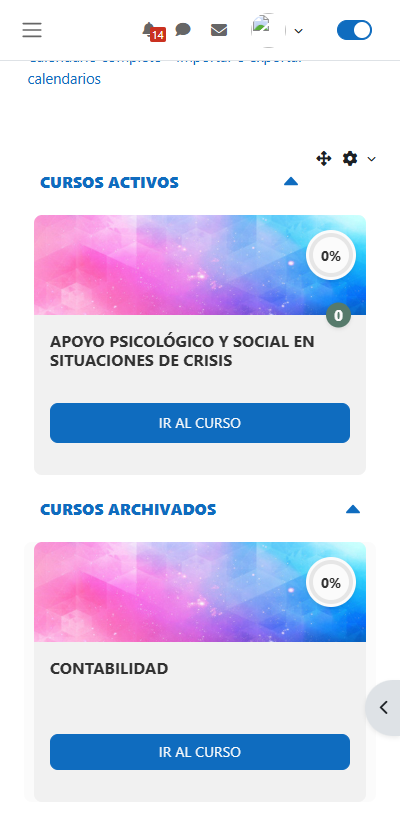

# 🎓 Bloque de Cursos Slider para Moodle

Plugin de bloque para Moodle que muestra los cursos del usuario en un carrusel interactivo y responsive, construido con React.


---

## 📋 Tabla de Contenidos

- [Características](#-características)
- [Requisitos](#-requisitos)
- [Instalación](#-instalación)
- [Configuración](#-configuración)
- [Uso](#-uso)
- [Estructura del Proyecto](#-estructura-del-proyecto)
- [Desarrollo](#-desarrollo)
- [Capturas de Pantalla](#-capturas-de-pantalla)
- [Tecnologías Utilizadas](#-tecnologías-utilizadas)
- [Contribuir](#-contribuir)
- [Licencia](#-licencia)

---

## ✨ Características

### 🎯 Funcionalidades Principales

- **Carrusel Interactivo**: Visualización de cursos en un carrusel responsive con navegación por flechas
- **Categorización Automática**: Los cursos se organizan en:
  - 📚 **Cursos Activos**: Cursos en progreso
  - ✅ **Cursos Terminados**: Cursos completados al 100%
  - 🔜 **Próximos Cursos**: Cursos disponibles para inscribirse
  - 📦 **Cursos Archivados**: Cursos antiguos
- **Barra de Progreso**: Indicador visual del progreso en cada curso
- **Soporte para GIFs**: Detección y manejo optimizado de imágenes GIF
- **Notificaciones**: Contador de notificaciones pendientes por curso
- **Responsive Design**: Adaptación automática a diferentes tamaños de pantalla
- **Multiidioma**: Soporte para Español e Inglés

### 🎨 Características Técnicas

- **React 18.2**: Frontend moderno y reactivo
- **Hook Personalizado**: `useResponsiveCarousel` para adaptación dinámica
- **Componentes Modulares**: Arquitectura escalable y mantenible
- **Optimización de Rendimiento**: Lazy loading y memoización
- **Compatibilidad con Temas**: Funciona con Boost y temas personalizados

---

## 📦 Requisitos

### Requisitos del Servidor

- **Moodle**: 4.4+ (Build: 20240903 o superior)
- **PHP**: 7.4 o superior
- **MySQL/PostgreSQL**: Según requisitos de Moodle

### Requisitos de Desarrollo

- **Node.js**: 14.x o superior
- **npm**: 6.x o superior
- **Git**: Para control de versiones

---

## 🚀 Instalación

### Método 1: Instalación Manual

1. **Descargar el Plugin**

   ```bash
   cd /path/to/moodle/blocks
   git clone https://github.com/tu-usuario/cursos_slider.git
   ```

2. **Instalar Dependencias de Node.js**

   ```bash
   cd cursos_slider/react/app
   npm install
   ```

3. **Compilar React**

   ```bash
   npm run build
   ```

4. **Actualizar Moodle**
   - Accede a `Administración del sitio > Notificaciones`
   - Moodle detectará el nuevo plugin
   - Haz clic en "Actualizar base de datos de Moodle"

5. **Purgar Cachés**

   ```bash
   cd /path/to/moodle
   php admin/cli/purge_caches.php
   ```

### Método 2: Instalación desde ZIP

1. Descarga el archivo ZIP del plugin
2. Ve a `Administración del sitio > Plugins > Instalar plugins`
3. Arrastra el archivo ZIP o selecciónalo
4. Sigue las instrucciones en pantalla
5. Compila React (pasos 2-3 del Método 1)

---

## ⚙️ Configuración

### Añadir el Bloque a una Página

1. Activa el modo de edición en tu página de Moodle
2. Haz clic en "Añadir un bloque"
3. Selecciona "Cursos Slider"
4. El bloque aparecerá en la región seleccionada

### Configuración del Bloque

El bloque no requiere configuración adicional. Funciona automáticamente al:

- Detectar los cursos del usuario
- Categorizar según estado de finalización
- Calcular el progreso automáticamente

---

## 📖 Uso

### Para Estudiantes

El bloque muestra automáticamente:

- **Cursos Activos**: Cursos en los que estás inscrito y en progreso
- **Cursos Terminados**: Cursos que has completado
- **Próximos Cursos**: Cursos disponibles para inscribirte
- **Cursos Archivados**: Cursos antiguos o inactivos

### Para Profesores/Administradores

Los profesores ven:

- **Cursos Activos**: Cursos que están impartiendo
- **Cursos Terminados**: Cursos finalizados
- **Cursos Archivados**: Cursos antiguos

### Interacción

- **Navegación**: Usa las flechas laterales para navegar entre cursos
- **Acceso Rápido**: Haz clic en cualquier tarjeta para ir al curso
- **Colapsar Secciones**: Haz clic en el título de cada sección para expandir/colapsar

---

## 📁 Estructura del Proyecto

```
cursos_slider/
├── 📄 block_cursos_slider.php    # Clase principal del bloque
├── 📄 version.php                # Información de versión
├── 📄 settings.php               # Configuración del plugin
├── 📄 styles.css                 # Estilos base
├── 📄 README.md                  # Este archivo
│
├── 📁 lang/                      # Archivos de idioma
│   ├── en/
│   │   └── block_cursos_slider.php
│   └── es/
│       └── block_cursos_slider.php
│
├── 📁 services/                  # Servicios PHP
│   └── CourseService.php         # Lógica de negocio de cursos
│
├── 📁 db/                        # Definiciones de base de datos
│   └── access.php                # Capacidades y permisos
│
└── 📁 react/                     # Aplicación React
    └── app/
        ├── 📄 README.md          # Documentación de React
        ├── 📄 package.json
        ├── 📄 vite.config.js
        │
        └── src/
            ├── 📄 App.jsx        # Componente principal
            ├── 📄 App.css        # Estilos globales
            ├── 📄 main.jsx       # Punto de entrada
            │
            ├── 📁 components/    # Componentes React
            │   ├── CourseAccordion.jsx
            │   ├── CourseCarousel.jsx
            │   ├── CoursesActive.jsx
            │   ├── CoursesActiveDoc.jsx
            │   ├── CoursesEnded.jsx
            │   ├── CoursesNext.jsx
            │   ├── CoursesStore.jsx
            │   ├── GifImage.jsx
            │   └── ProgressBar.jsx
            │
            └── 📁 hooks/         # Hooks personalizados
                └── useResponsiveCarousel.js
```

---

## 🛠️ Desarrollo

### Configurar Entorno de Desarrollo

1. **Clonar el Repositorio**

   ```bash
   git clone https://github.com/tu-usuario/cursos_slider.git
   cd cursos_slider
   ```

2. **Instalar Dependencias**

   ```bash
   cd react/app
   npm install
   ```

3. **Modo Desarrollo**

   ```bash
   npm run dev
   ```

   Esto iniciará el servidor de desarrollo de Vite en `http://localhost:5173`

### Compilar para Producción

```bash
npm run build
```

Los archivos compilados se generarán en `react/app/dist/`

### Purgar Cachés de Moodle

Después de cada cambio:

```bash
php admin/cli/purge_caches.php
```

### Estructura de Componentes React

Para más detalles sobre la arquitectura de React, consulta [react/app/README.md](react/app/README.md)

---

## 📸 Capturas de Pantalla

### Vista Principal

<div align="center">
  
### Vista en Tema Boost


*Bloque de Cursos Slider mostrando cursos activos, terminados y próximos cursos*

### Vista en tema Boost Mobile



*El bloque se adapta perfectamente al tema Boost de Moodle*

---

### Vista en Tema Personalizado


*El bloque se adapta perfectamente al tema Boost de Moodle*

</div>

---

## 🔧 Tecnologías Utilizadas

### Backend (PHP)

- **Moodle API**: Integración nativa con Moodle
- **PHP 7.4+**: Programación orientada a objetos
- **SQL**: Consultas optimizadas a la base de datos

### Frontend (React)

- **React 18.2**: Biblioteca de UI
- **Vite**: Build tool y dev server
- **react-multi-carousel**: Componente de carrusel
- **CSS3**: Estilos modernos con variables CSS

### Herramientas de Desarrollo

- **Node.js & npm**: Gestión de dependencias
- **Git**: Control de versiones
- **ESLint**: Linting de código JavaScript

---

## 📄 Licencia

Este proyecto está licenciado bajo GPL-3.0 - ver el archivo [LICENSE](LICENSE) para más detalles.

---

## 👤 Autor

**Samuel Zabala**

- GitHub: [@SamuelP21](https://github.com/SamuelP21)
- Portfolio: [samuelzabala.dev](https://samuelzabala.dev)

---

**¿Te gusta este plugin? ⭐ Dale una estrella en GitHub!**
