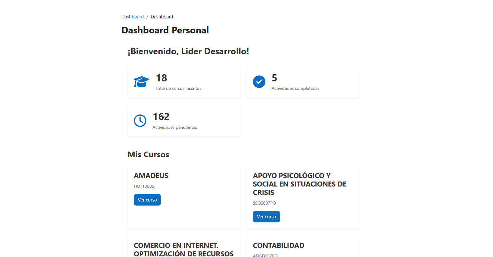
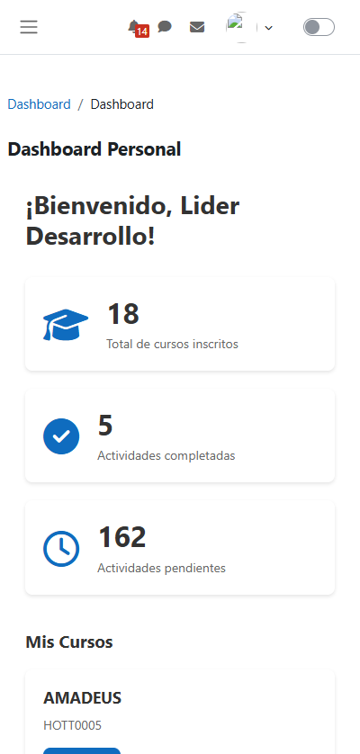
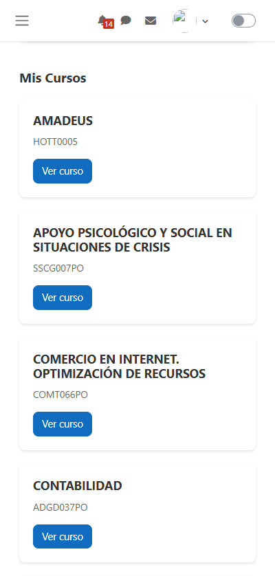

# 📊 Dashboard Personal - Plugin Local para Moodle

Un plugin de dashboard moderno y responsive para Moodle que muestra estadísticas personalizadas del usuario e información de cursos.


## 🎯 Características

- **Estadísticas del Usuario**: Muestra el total de cursos inscritos y actividades completadas.
- **Vista General de Cursos**: Vista en cuadrícula de todos los cursos del usuario.
- **Diseño Responsive**: Interfaz moderna con estilos SCSS y layouts en grid.
- **Soporte Multi-idioma**: Traducciones en inglés y español incluidas.
- **Templates Mustache**: Separación clara entre lógica y presentación.
- **Sistema de Permisos**: Control de acceso basado en capabilities.

## 📸 Capturas de Pantalla

<div align="center">

### Vista de Escritorio



*Dashboard mostrando estadísticas del usuario y cursos inscritos*

---

### Vista Móvil

<table>
  <tr>
    <td align="center">
      
      <br/>
      <em>Estadísticas del usuario</em>
    </td>
    <td align="center">
      
      <br/>
      <em>Lista de cursos inscritos</em>
    </td>
  </tr>
</table>

</div>

## 🚀 Instalación

### Requisitos

- Moodle 4.4 o superior.
- PHP 7.4 o superior.
- Node.js 20.x (para compilación de SCSS).

### Pasos

1. **Copiar el plugin a Moodle:**

   ```bash
   cp -r dashboard /ruta/a/moodle/local/
   ```

2. **Instalar el plugin:**
   - Navegar a: **Administración del sitio → Notificaciones**
   - Hacer clic en **Actualizar base de datos de Moodle**

3. **Compilar SCSS (si se modifica):**

   ```bash
   cd /ruta/a/moodle
   sass local/dashboard/scss/styles.scss local/dashboard/scss/styles.css
   php admin/cli/purge_caches.php
   ```

4. **Acceder al dashboard:**
   - URL: `http://tumoodle.com/local/dashboard/index.php`
   - O vía: **Administración del sitio → Dashboard Personal**

## 📁 Estructura de Archivos

```
local/dashboard/
├── README.md                           # Este archivo
├── version.php                         # Metadatos del plugin
├── settings.php                        # Página de configuración
├── index.php                           # Página principal del dashboard
├── lib.php                             # Funciones helper y hooks
├── db/
│   └── access.php                      # Definición de capabilities
├── lang/
│   ├── en/
│   │   └── local_dashboard.php         # Strings en inglés
│   └── es/
│       └── local_dashboard.php         # Strings en español
├── templates/
│   └── index_page.mustache             # Template del dashboard
└── scss/
    ├── styles.scss                     # Código fuente SCSS
    ├── styles.css                      # CSS compilado
    └── styles.css.map                  # Mapa de código fuente
```

## 🛠️ Detalles Técnicos

### Arquitectura

Este plugin sigue las mejores prácticas de Moodle:

- **Patrón MVC**: Separación de responsabilidades con templates, lógica y estilos.
- **Templates Mustache**: Para renderizar contenido HTML.
- **SCSS**: Para estilos mantenibles y modulares.
- **Capabilities**: Control de acceso basado en permisos.
- **Multi-idioma**: Soporte completo de internacionalización.

### Componentes Clave

#### 1. **Página Principal (`index.php`)**

Maneja la configuración de la página, obtención de datos y renderizado.

```php
// Cargar estadísticas del usuario
$stats = local_dashboard_get_user_stats($userid);
$courses = local_dashboard_get_user_courses($userid);

// Renderizar con Mustache
echo $OUTPUT->render_from_template('local_dashboard/index_page', $data);
```

#### 2. **Funciones Helper (`lib.php`)**

Consultas a la base de datos y hooks de navegación.

```php
function local_dashboard_get_user_stats($userid)
function local_dashboard_get_user_courses($userid)
function local_dashboard_extend_navigation(global_navigation $nav)
```

#### 3. **Template Mustache (`templates/index_page.mustache`)**

Estructura HTML limpia con renderizado condicional.

```mustache
{{#hascourses}}
  <div class="courses-grid">
    {{#courses}}
      <div class="course-card">...</div>
    {{/courses}}
  </div>
{{/hascourses}}
```

#### 4. **Estilos SCSS (`scss/styles.scss`)**

Diseño moderno y responsive con:

- Layouts CSS Grid.
- Flexbox para alineación de tarjetas.
- Efectos hover y transiciones.
- Breakpoints responsive para móviles.

## 🎨 Personalización

### Modificar Estilos

1. Editar `scss/styles.scss`
2. Compilar a CSS:

   ```bash
   sass local/dashboard/scss/styles.scss local/dashboard/scss/styles.css
   ```

3. Purgar cachés:

   ```bash
   php admin/cli/purge_caches.php
   ```

### Añadir Nuevas Estadísticas

1. Crear una nueva función en `lib.php`:

   ```php
   function local_dashboard_get_user_badges($userid) {
       global $DB;
       // Tu consulta aquí
   }
   ```

2. Añadir a `index.php`:

   ```php
   $data['badges'] = local_dashboard_get_user_badges($userid);
   ```

3. Actualizar el template en `templates/index_page.mustache`

### Añadir Idiomas

1. Crear nuevo directorio: `lang/[código_idioma]/`
2. Copiar `lang/en/local_dashboard.php` al nuevo directorio.
3. Traducir todos los strings.

## 🔐 Permisos

El plugin define una capability:

- **`local/dashboard:view`**: Ver el dashboard personal

Por defecto, se otorga a todos los usuarios autenticados.

## 🧪 Desarrollo

### Workflow de Compilación SCSS

**Opción 1: Compilación manual**

```bash
sass local/dashboard/scss/styles.scss local/dashboard/scss/styles.css
```

**Opción 2: Modo watch (auto-compilación al guardar)**

```bash
sass --watch local/dashboard/scss/styles.scss:local/dashboard/scss/styles.css
```

**Opción 3: Usando Grunt (requiere Node.js 20.x)**

```bash
npx grunt scss --root=local/dashboard
```

### Depuración

Habilitar depuración en Moodle:

```php
// config.php
$CFG->debug = (E_ALL | E_STRICT);
$CFG->debugdisplay = 1;
```

## 📝 Consultas a la Base de Datos

El plugin utiliza estas consultas principales:

### Contar Cursos Inscritos

```sql
SELECT COUNT(DISTINCT c.id)
FROM {course} c
JOIN {enrol} e ON e.courseid = c.id
JOIN {user_enrolments} ue ON ue.enrolid = e.id
WHERE ue.userid = :userid AND c.id != 1
```

### Contar Actividades Completadas

```sql
SELECT COUNT(*)
FROM {course_modules_completion} cmc
WHERE cmc.userid = :userid AND cmc.completionstate > 0
```

### Obtener Cursos del Usuario

```sql
SELECT c.id, c.fullname, c.shortname, c.summary
FROM {course} c
JOIN {enrol} e ON e.courseid = c.id
JOIN {user_enrolments} ue ON ue.enrolid = e.id
WHERE ue.userid = :userid AND c.id != 1
ORDER BY c.fullname
```

## 🐛 Solución de Problemas

### El dashboard no aparece en la navegación

- Purgar todas las cachés: **Administración del sitio → Desarrollo → Purgar todas las cachés**
- Acceder directamente vía URL: `/local/dashboard/index.php`

### Los estilos no se cargan

- Verificar que existe el archivo CSS: `local/dashboard/scss/styles.css`
- Revisar la consola del navegador para errores 404.
- Purgar cachés después de cambios en SCSS.

### Permiso denegado

- Verificar que el usuario tiene la capability `local/dashboard:view`
- Verificar que el usuario está autenticado (no es invitado)

**Tecnologías utilizadas:**

- PHP.
- API de Moodle.
- Mustache.
- SCSS/CSS.
- SQL.

---

**Versión:** 1.0.0  
**Versión de Moodle:** 4.4+  
**Última Actualización:** Noviembre 2025
